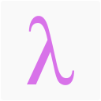

# (λstudy.group)

<p align="center">
  
</p>

:notebook: :pencil2: Repositório do grupo de estudos sobre programação funcional do [Telegram](https://t.me/lambdastudygroup).

## :grey_question: Como funciona

O intuito do grupo é a participação coletiva de todos e o aprendizado de cada um.
No grupo do telegram você pode tirar duvidas, sugerir projetos e conversar sobre temas relacionados a programação funcional
Para praticar temos alguns repositórios em que você pode resolver alguns exercicios.

## :bulb: Projetos atuais

 - [Telegram Bot](https://github.com/lambda-study-group/telegram-bot)
 - [Juntar conteudo academico e pratico de várias linguagens em um awesome](https://github.com/lambda-study-group/awesome-functional-studies)
 - [Resolver exercicios da trilha de programação funcional do hacker rank](https://github.com/lambda-study-group/hacker-rank)
 - [Resolver exercicios de linguagens funcionais no exercism](https://github.com/lambda-study-group/exercism)
 - [Fazer os exercicios do livro SICP em várias linguagens diferentes](https://github.com/lambda-study-group/sicp)

## :gun: Regras do grupão

- Bom senso
- Intolerancia não será tolerada
- Sem spam. Pode postar evento, post etc desde que tenha relação com o grupo
- Podemos bater papo sobre coisas da vida mas se for muito nada a ver apagaremos

## Contribuindo na landing page desse repo

A landing page é feita em elm, para isso você precisa instalar pelo terminal:
```bash
# pela npm
npm install -g elm

# pelo yarn
yarn global add elm
```

Ou por links do windows e mac [aqui](https://guide.elm-lang.org/install.html)

Para contribuir basta mexer no Main.elm e rodar esse comando para gerar um elm.js pimpão:
```bash
elm-make Main.elm --output elm.js
```
